# Windows Server 2022 Setup

Steps to installing Windows Server 2022

## Steps to create a virtual machine instance

### Step 1: Click "Power on this virtual machine"

- Once the system boots up click inside the virtual machine to directly control it.
- Press Ctrl + Alt to get back to your host laptop, or click outside of VMware

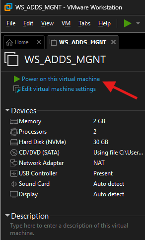

### Step 2: Upon boot press any key

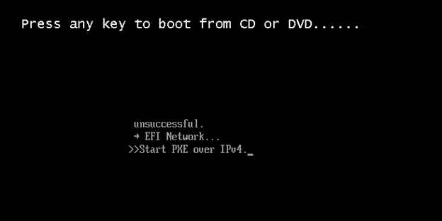

### Step 3: Select the language and time zone format and click "Next"

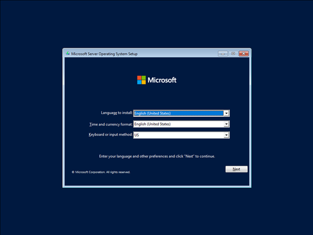

### Step 4: Click "Install now" to begin the installation process

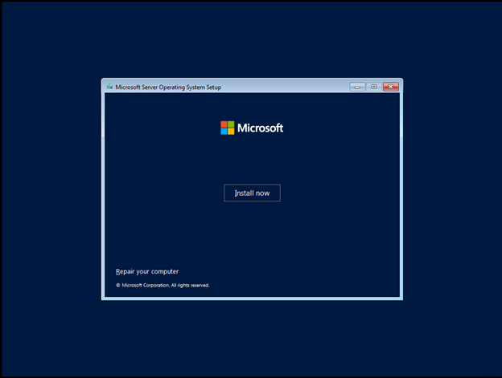

### Step 5: Choose Windows Server 2022 Standard Evaluation (Desktop Experience) and click "Next"

- Standard Evaluation (Desktop Experience) installs with a GUI, whereas the Standard Evaluation installs with a command line

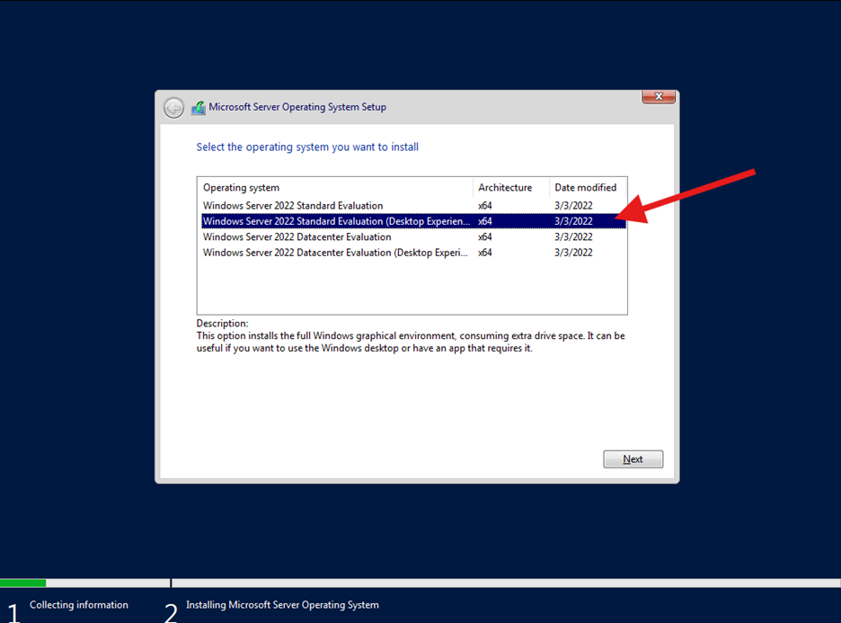

### Step 6: Check the box on the bottom left and click "Next"

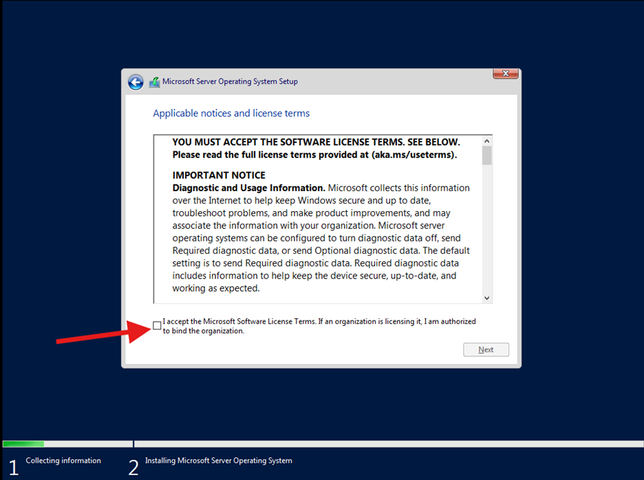

### Step 7: Click "Custom: Install Microsoft Server Operating System only (advanced)"

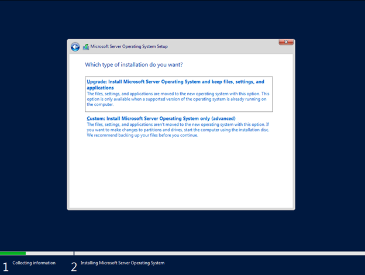

### Step 8: Check and ensure that your parameter are correct and click "Next"

- Parameters should be the same as step 6 of the previous section and match the sidebar from VMware where you clicked "Power on this virtual machine".

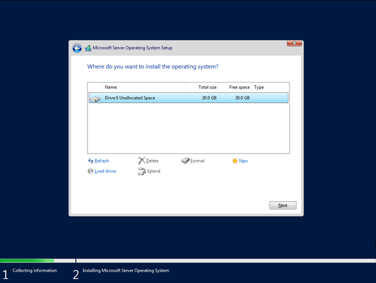

### Step 9: Operating system should start installing

- Wait for the installation to finish

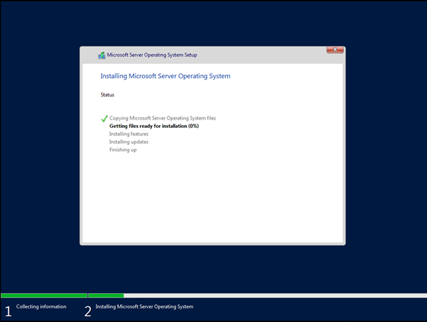

### Step 10: After installation you will be greeted with "Customize settings"

- Enter a password you will remember later

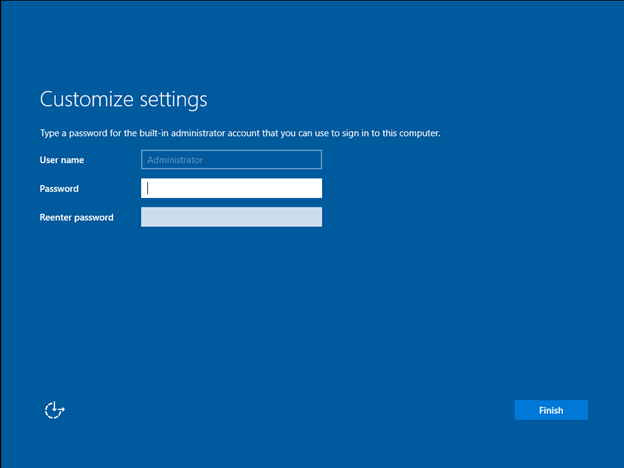

### Step 11: Next load into the lock screen.

- Press "Ctrl + Alt + Del" on your keybaord to proceed to the login page.
- Alternatively click "VM" on the top lef, then click "Send Ctrl + Alt + Del"

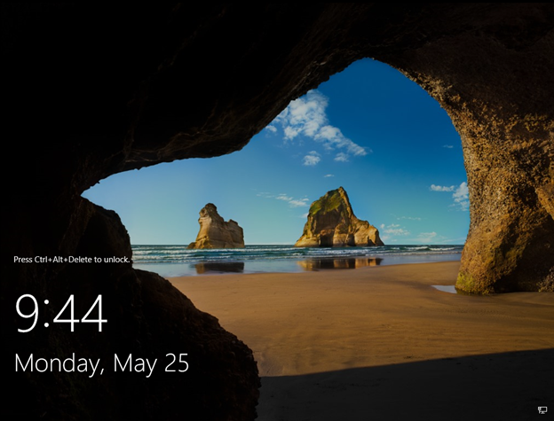
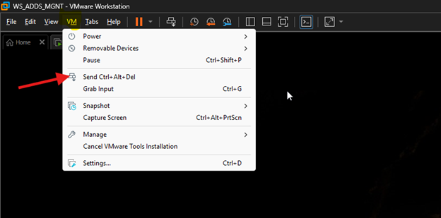

### Step 12: Enter your password from "Step 10"

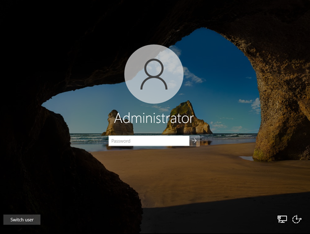
