# Active Directory Domain System

After installing your Windows Server, Active Directory is not enabled by default. This section focuses on the role-based installation and activation of the Active Directory feature along with its required components, and then setting up a local Domain.

## Steps to Active Directory & Set up a local Domain

- At logging into the Windows Server for the First time Server Manager will automatically launch

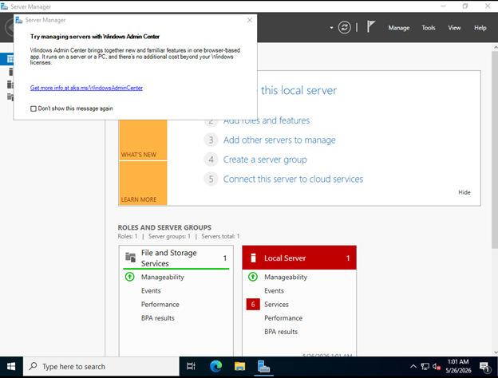

- You can get back into Server Manager later by pressing or clicking the start menu button on your keyboard or on the bottom left corner

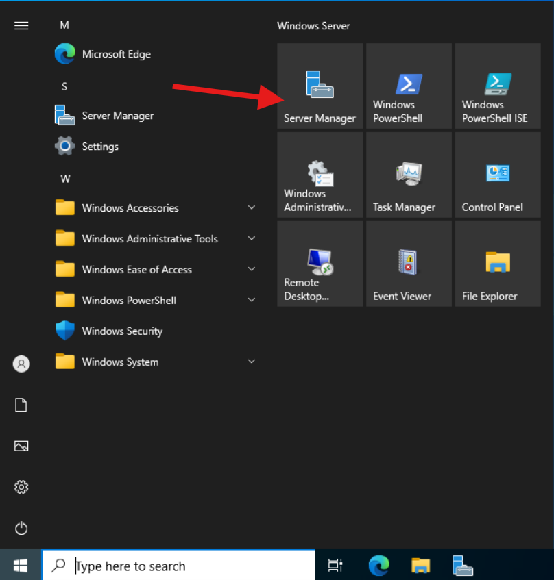

### Step 1: Go back into the Server Manager Dashboard and click "Manage", then in the dropdown click "Add roles and Features"

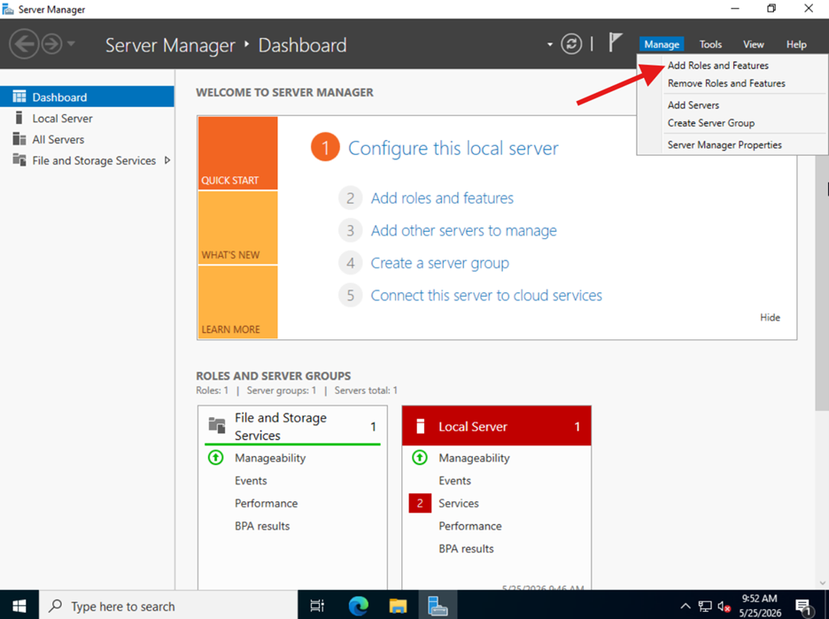

### Step 2: In the "Before you begin" click "Next"

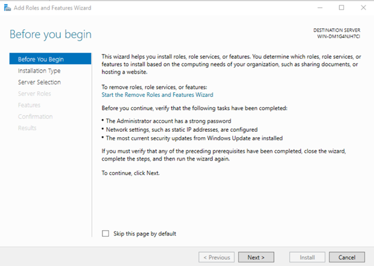

### Step 3: In "Select installation type" select "Role based or feature-based installation" and click "Next"

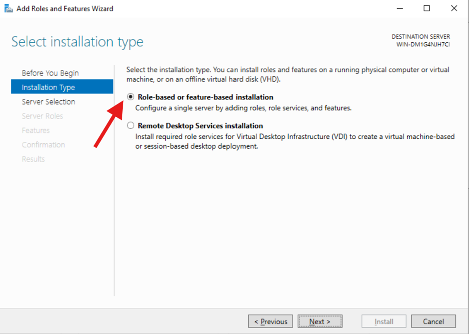

### Step 4: Then for "Select destination server" choose "Select a server from the server pool" and click "Next"

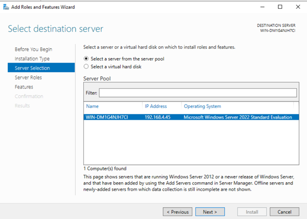

### Step 5: In "Select Server roles"

- Click on inside the box next to "Active Directory Domain Services" (A black square should appear inside all selected roles)
- A pop-up window will appear showing the required management tools
- Click "Add features"
- Repeat steps for all roles you want to add and click "Next" when done

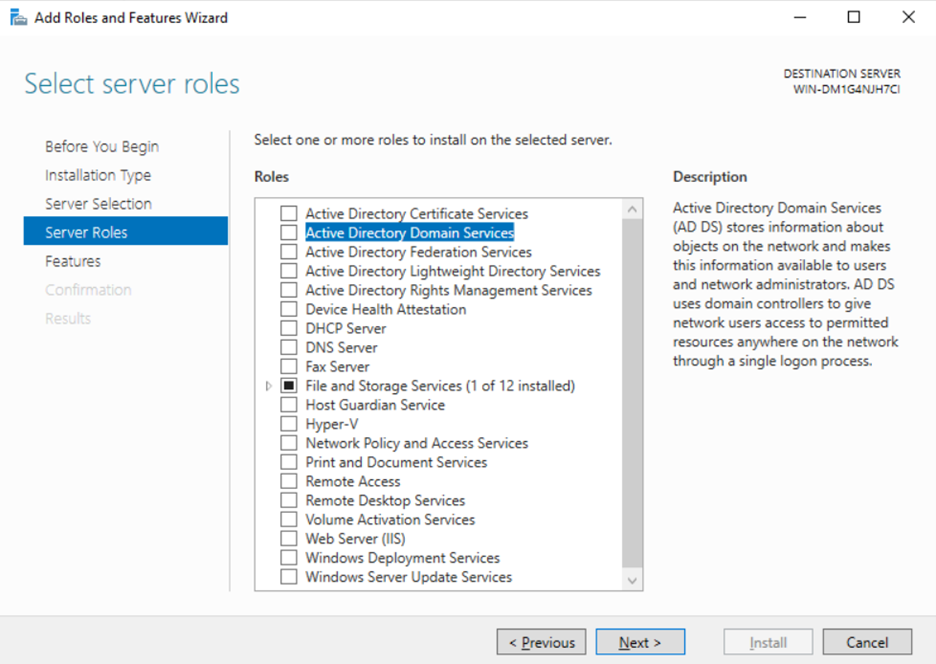

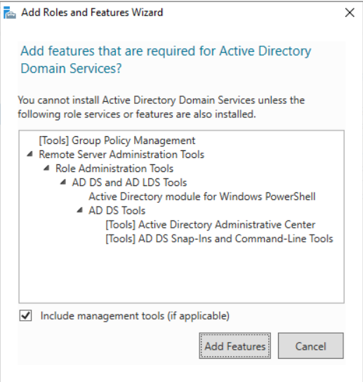

### Step 6: In Features

- Ensure that necessary feature are selected and Click "Next" for the roles/features if you have others selected

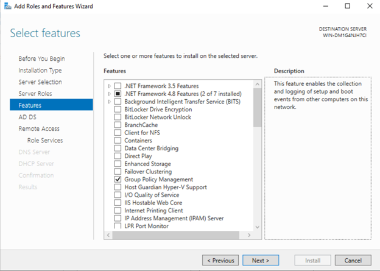

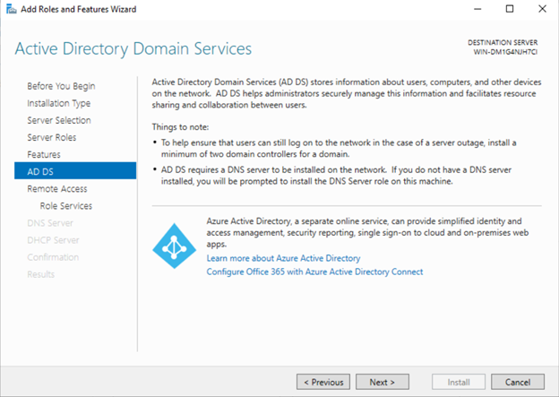

### Step 7: If you have roles like "Remote access", "Web server" or similar selected

- Click "Next" and select the "Role services", then click "Next"

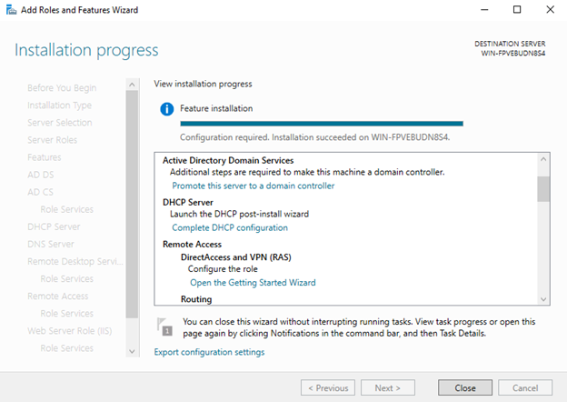

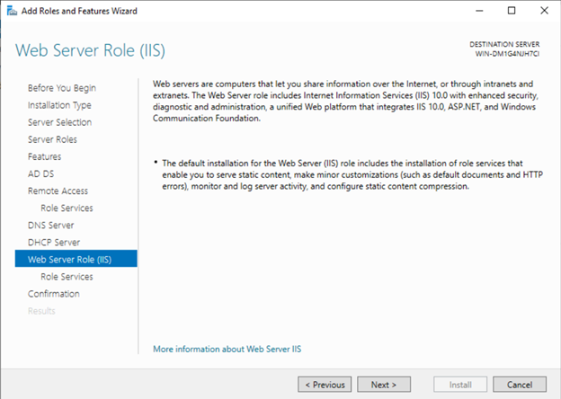

### Step 8: For all other roles

- Click "Next"

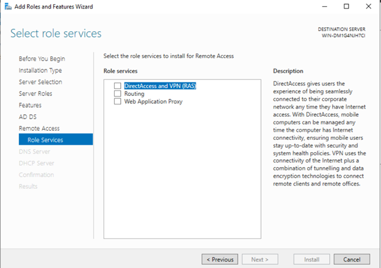

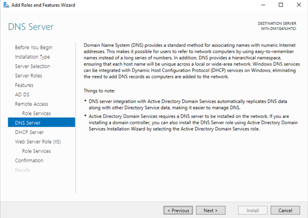

### Step 9: in "Confirmation"

- Click install in the "Confirmation" page
- Wait for installation to finish

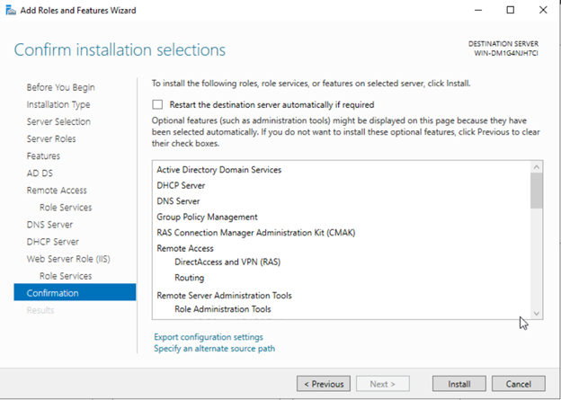

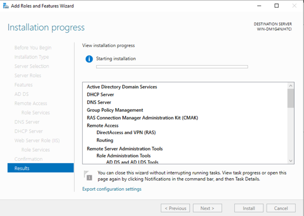

### Step 10: Promote a Domain

- In the "Result" page after installation is complete
- Scroll down to "Active Directory Domain Services"
- Click "Promote this server to a domain controller"

### Step 11: In "Deployement configuration"

- Select "Add a new forest"
- For "root domain name" enter a name for your private Domain (_for example: your_custom_name.interal, or your_custom_name.lab_)
- **Important naming conventions**
- I suggest using "_.internal, or .lab_"
- **Do Not Use Official/Public Domains** If you use existing domain like "_yahoo.com_" (an official domain) all your traffic will be routed through your internal Domain controller, preventing you from accessing the actual public website in your lab environment.
- **Microsoft Recommendation** Microsoft recommends not using "_.local_" for internal domain extensions because many modern networks services use "_.local_" by default and it may cause routing conflicts.

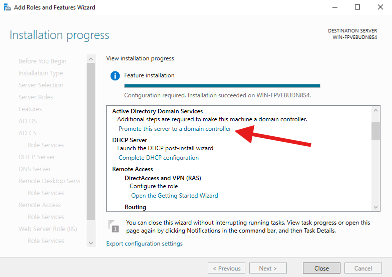

### Step 12: In "Domain controller options"

- For "Forest functional level" and "Domain functional level": These options adjust how far back you want your domain controller to be compatible with older version of Active Directory
- Enter and Confirm a password that you will remember for your domain then click "Next"
- This password will be used to boot into safe mode if windows server becomes corrupt

### Step 13: In "DNS Options"

- Click "Next"

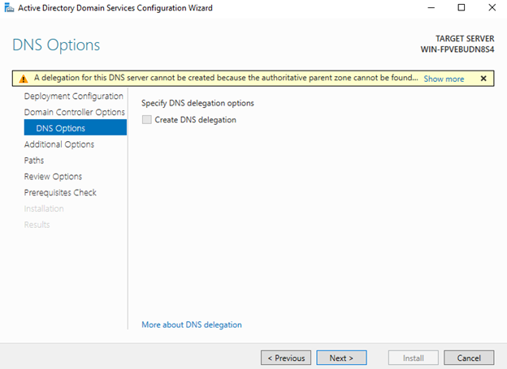

### Step 14: In "Additional Options"

- Ensure the Domain name is correct and click "Next"

### Step 15: In "Paths"

- Click "Next"

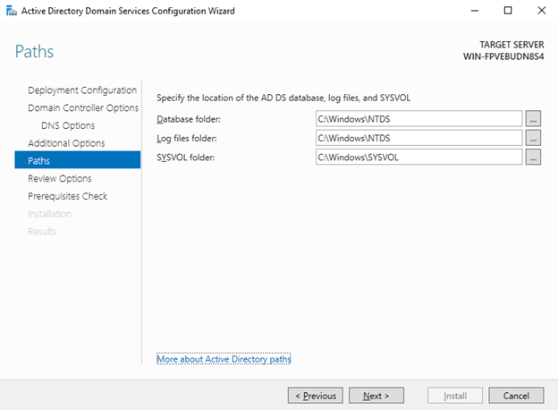

### Step 16: In "Review Options"

- Ensure that all configuration are correct

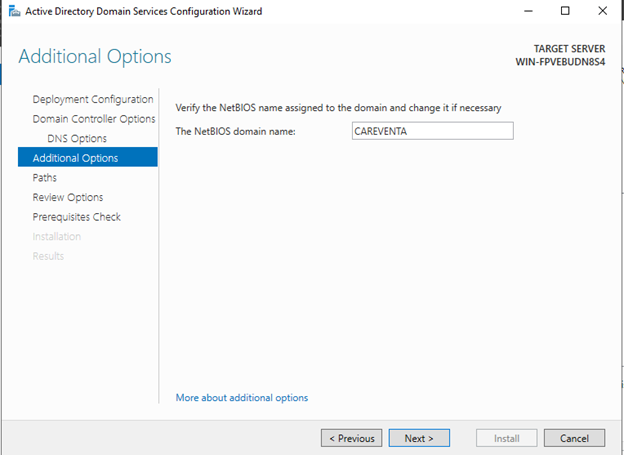

### Step 17: In "Prerequisite check"

- Wait for prerequisite check to complete then click "Install"
- Wait for installation to finish

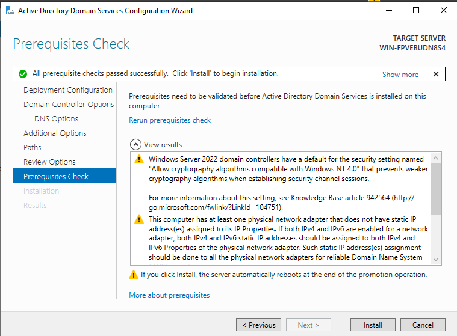

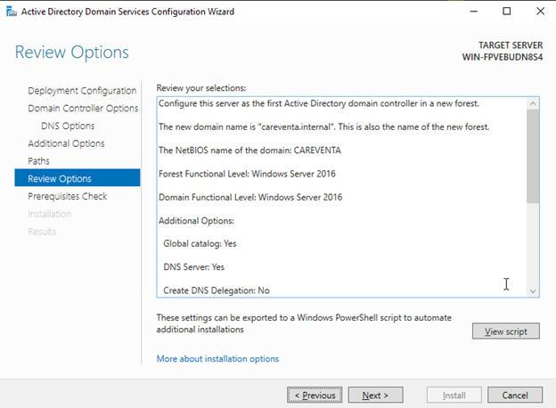

### Step 18: Login into the Domain

- Once the installation is finished the system will restart and apply the new Domain Controller and roles
- After restart you will go to the login page of the domain eg. Notice the "_CAREVENTA\Administrator_"
- Log in with your regular Administrator password

