git # Virtual Windows Server 2022 Deployment: Active Directory & IT Support

## Project Overview

This repository documentation explains how I set up Active Directory in VMware using Windows Server 2022.

## Table of Contents

- [1. VMware](#vmware)
- [2. Windows Servers](#windows-servers)
- [3. Creating a Virtual Machine Instance](#creating-a-virtual-machine-instance)

---

## VMware

Before hosting Windows Server 2022, we need a hypervisor. A hypervisor is software or hardware that allows you to create and run virtual machine instances. I chose VMware Workstation Pro which is a type 2 Hypervisor meaning that it runs on top of the existing operating system.

## Steps to download VMware

### Step 1: Go to the official VMware download page: https://www.vmware.com/products/desktop-hypervisor/workstation-and-fusion

### Step 2: Select the Download option for VMware Workstation Pro.

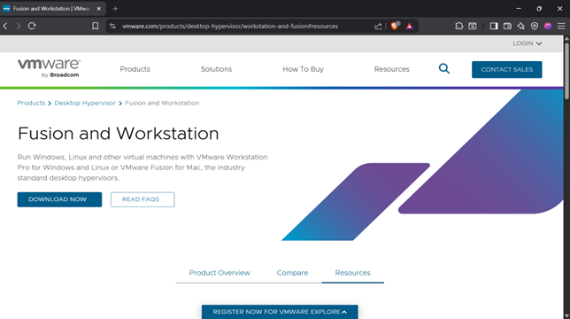

### Step 3: You will be prompted to sign in to your VMware account.

- You need a VMware account to be able to download it.
- If you already have an account, enter your username and password.
- If not, click LOGIN on the right, then Register to create a new account before downloading.

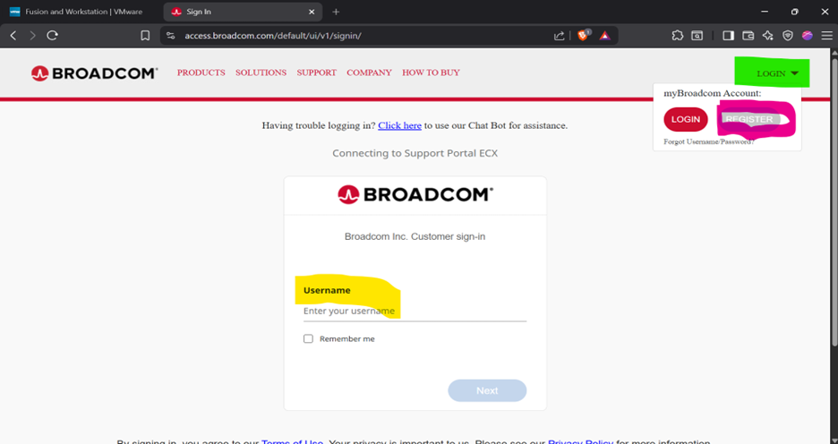

### Step 4: Once logged in

- Select My Downloads from the left hand menu. On the next page, click “Here” under Free Software Downloads to view the available VMware software.

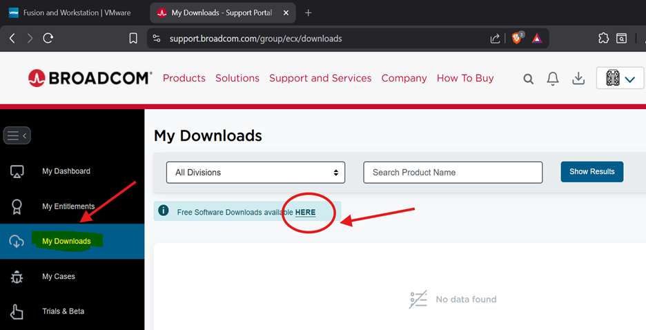

### Step 5: Filter for VMware Products

- Under All Divisions, select VMware, then click Show Results to display the available downloads.

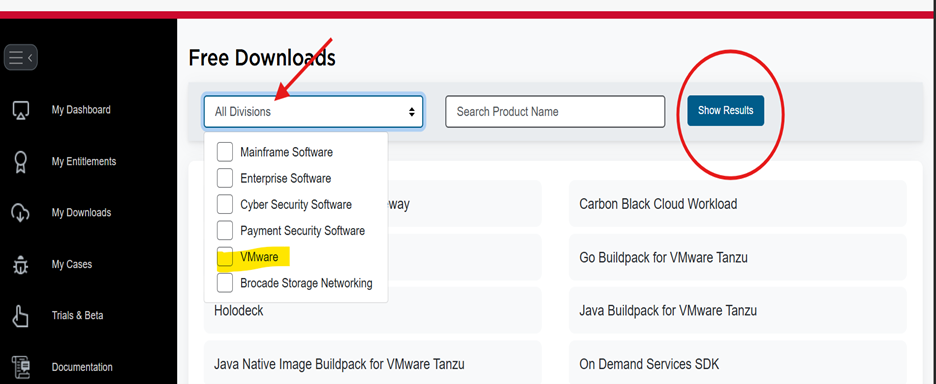

### Step 6: Select VMware Workstation Pro

- Scroll down and click VMware Workstation Pro.

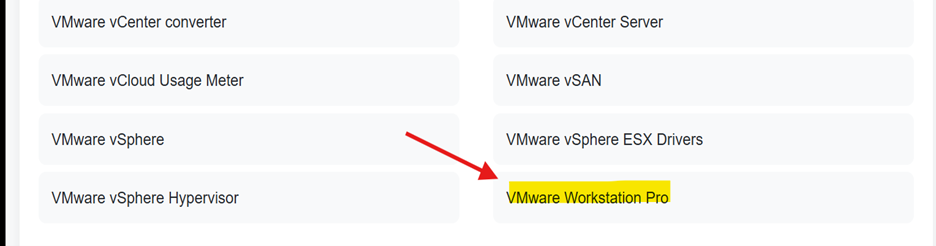

### Step 7: Download VMware Workstation Pro

- From the list of available versions, click on the one that matches your operating system.

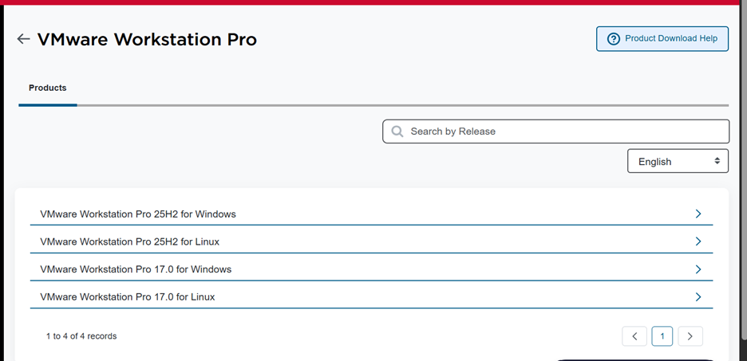

## Windows Servers

Windows Server 2022 is Microsoft’s enterprise level operating system designed to help organizations manage their IT infrastructure, services, and business assets.

## Steps to Download Windows Server ISO

### Step 1. Go to the official Microsoft download page:

- Go to Microsoft Evaluation Center registration page.
- Complete the registration form and click download now at the bottom: https://info.microsoft.com/ww-landing-windows-server-2022.html

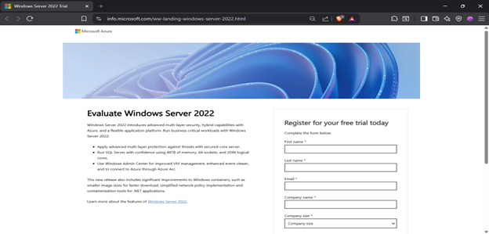

### Step 2. Redirected to download page:

- After clicking Download now.
- You will be redirected to the download page: https://www.microsoft.com/en-us/evalcenter/download-windows-server-2022
- Choose "ISO downloads 64-bit edition" for your language.
- Choose a location to save your file and the download will start in your browser.
  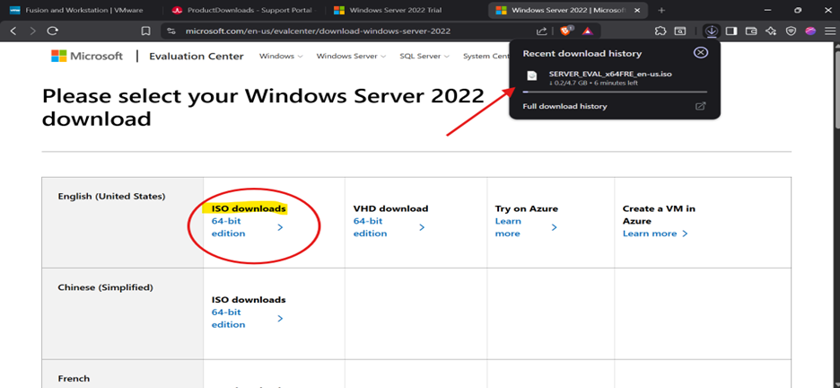

## Creating a Virtual Machine Instance

Steps to Create a virtual machine instance and add ISO file

## Steps to create a virtual machine instance

### Step 1: Open your VMware Workstation Pro

- Click "Create a New Virtual Machine"

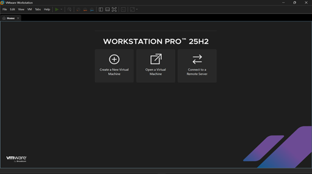

### Step 2: Click "Typical (recommended)", then click next

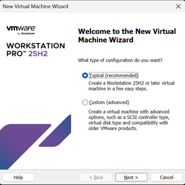

### Step 3: Select "I will install the operating system later" and click Next.

- This will create a blank VM where we will add the ISO file later.

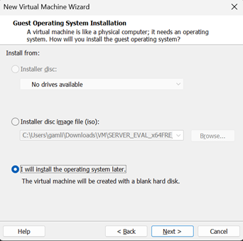

### Step 4: Guest Operating System

- Select "Microsoft Windows", then for Version choose "Windows Server 2022" in the dropdown menu and click Next

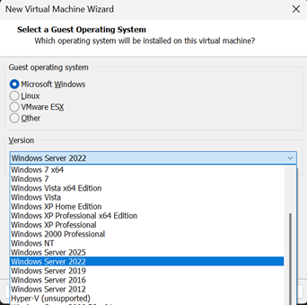

### Step 5: Virtual Machine Name

- For "Virtual machine name:" this will be VMware’s reference name to your virtual machine so feel free to change it or leave it default then click Next

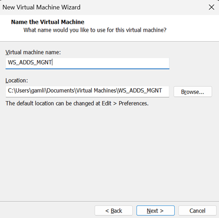

### Step 6: Choose the size of the virtual disk you want to allocate. If your device has limited storage, you can use the recommended 60 GB, or select a larger size such as 200 GB if you have the space available. For this project, I chose 30 GB, which is more than enough for a basic Windows Server installation.

- You will also need to choose how the virtual disk is stored on your computer.
- **Store virtual disk as a single file:** keeps the entire disk in one large file, which is easier to manage and can offer slightly better performance.
- **Split virtual disk into multiple files:** divides the disk into multiple smaller equal segments, which can make copying, moving, or backing up the VM more convenient.
  After selecting your preferred options, click Next.

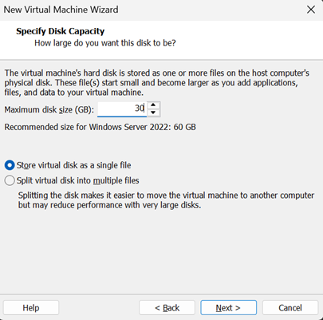

### Step 7: Verify that all settings, customization and changes are applied

- Click finish

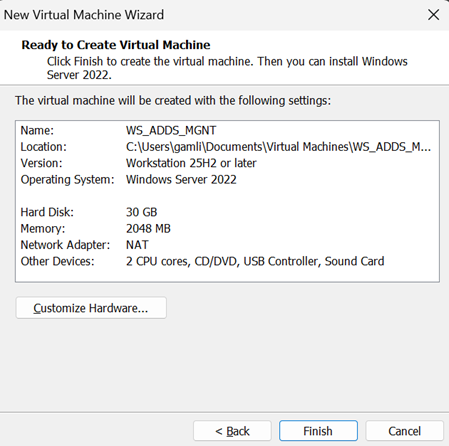

### Step 8: Notice your created VM on the left side of your VMware screen.

- Click CD/DVD (SATA)

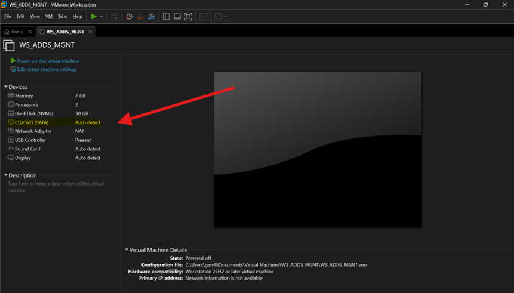

### Step 9: ISO image file

- In Connection click ‘use ISO image file’. Your file directory will open.
- Go to where you saved the Windows Server ISO you downloaded earlier and select it.
- After that Click “Network Adapter” on the left.

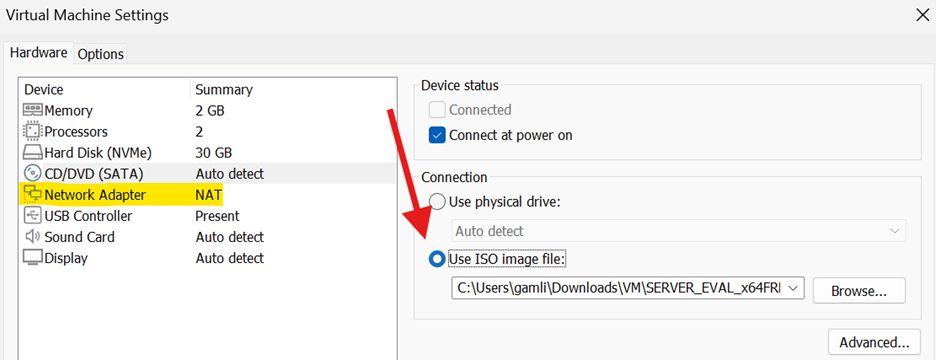

### Step 10: Network connection

- In the Network connection setting select "Bridged: connect directly to the physical network".
- Using bridged allows the virtual machine to connect directly to your router. The VM will receive its own IP address from the router.
- NAT – will allow the VM to share an IP address with the Host computer. As NAT the VM is invisible to all other devices on the network except the Host computer.
- Then Click OK

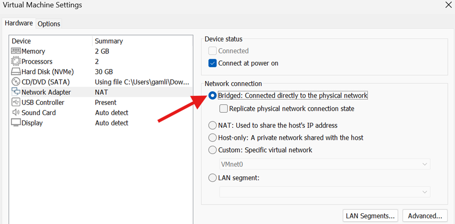
